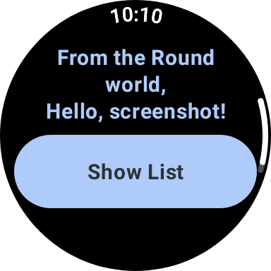

App de colectivos
==================================

Introduction
------------
Es una aplicacion que muestra los colectivos de MdP

Screenshots
-----------

Getting Started
---------------

Clona el repo y pone en build en android studio

Support
-------

- Stack Overflow: https://stackoverflow.com/questions/tagged/wear-os

If you've found an error in this sample, please [create an issue](https://github.com/android/wear-os-samples/issues/new).

Patches are encouraged, and may be submitted by forking this project and
submitting a pull request through GitHub. Please see CONTRIBUTING.md for more details.

[documentation]: https://developer.android.com/reference/kotlin/androidx/wear/compose/material/package-summary.html
[horologist]: https://github.com/google/horologist
[droidcon-talk]: https://www.droidcon.com/2023/11/15/easy-screenshot-testing-with-compose/
[wear-device]: https://github.com/android/wear-os-samples/blob/main/ComposeStarter/app/src/test/java/presentation/WearDevice.kt
[wear-preview-font-scales]: https://developer.android.com/reference/kotlin/androidx/wear/compose/ui/tooling/preview/WearPreviewFontScales
[wear-preview-devices]: https://developer.android.com/reference/kotlin/androidx/wear/compose/ui/tooling/preview/WearPreviewDevices
[ci-guide]: https://developer.android.com/training/testing/continuous-integration
